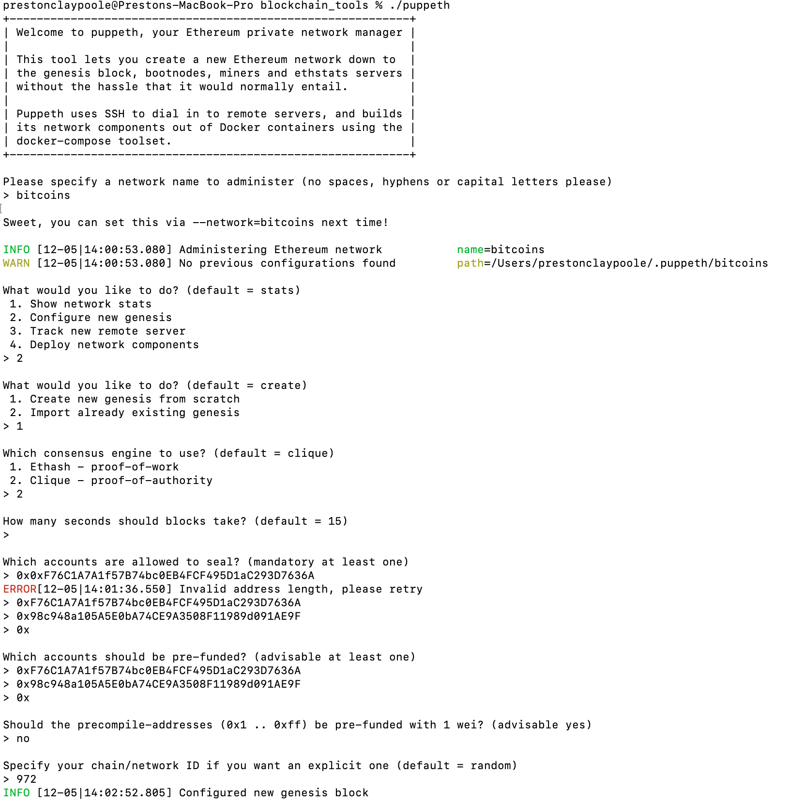
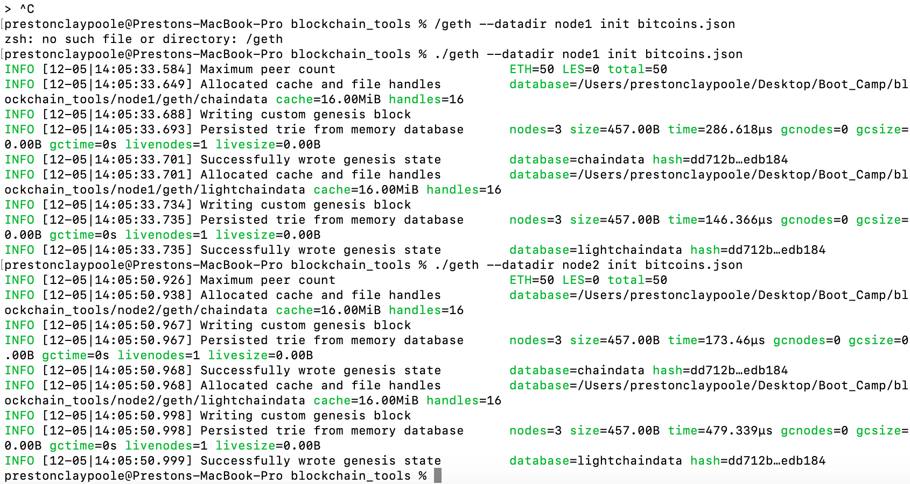
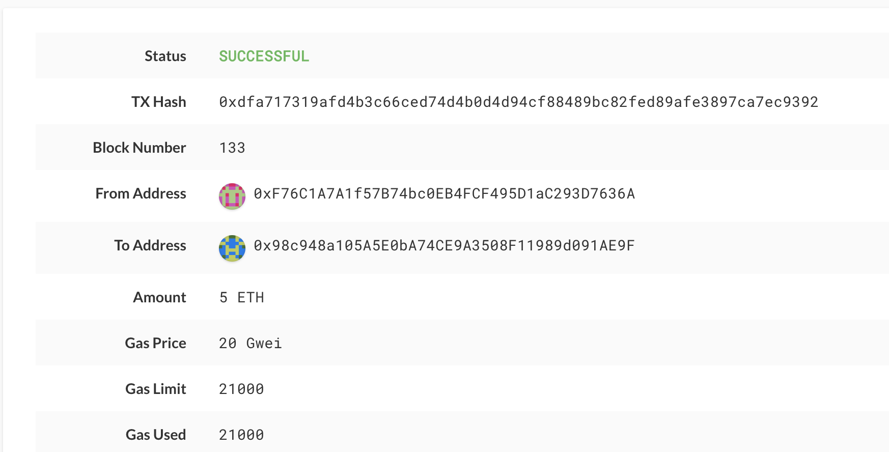

# Blockchain 

### Proof of Authority 

### Instructions

* Make sure you have installed the blockchain tools and MyCrypto. See documentation in the 
"blockchain_install_guide.md"
#
#

# Initialize ./puppeth command from command line. 
Documentation of setting up genesis block 
#### Network = bitcoins
#### ChainID = 972
#
#
# Initialize Nodes

### ./geth --datadir node1 init bitcoins.json
### ./geth --datadir node2 init bitcoins.json
Documentation initializing the nodes 
#
#
## Run Nodes in seperate terminals to begin mining. 
```
./geth --datadir node1 --unlock  "0xF76C1A7A1f57B74bc0EB4FCF495D1aC293D7636A" --mine --rpc --allow-insecure-unlock
```
```
./geth --datadir node2 --unlock "0x98c948a105A5E0bA74CE9A3508F11989d091AE9F" --mine --port 30304 --bootnodes "enode://e1da6a73405ef8cc2555ef20e05b29d15edf47155d7d422d8be506e2307ff058285577f9eebe78f431eaa8091c5493bee7e150d78e5f81c0155d6ee3cf30fff0@127.0.0.1:30303"  --allow-insecure-unlock
```

* The ```--mine``` flag tells the node to mine new blocks.

* The ```--bootnodes``` flag allows you to pass the network info needed to find other nodes in the blockchain. This will allow us to connect both of our nodes.

* The ```--rpc``` flag enables us to talk to our second node, which will allow us to use MyCrypto or Metamask to transact on our chain.

* The ```--allow-insecure-unlock``` Allow insecure account unlocking when account-related RPCs are exposed by http

* The ```enode://e1da6a73405ef8cc2555ef20e05b29d15edf47155d7d422d8be506e2307ff058285577f9eebe78f431eaa8091c5493bee7e150d78e5f81c0155d6ee3cf30fff0@127.0.0.1:30303``` is plucked from node 1 after we run node 1. 

### ** MAKE SURE YOU ARE IN THE blockchain_tools DIRECTORY WEHN RUNNING CODE **
### Node 1 Password: blockchain
### Node 2 Password: bitcoin
#
#
## After both terminals are running both nodes, create "custom" network and attach "keynote" file from node 1 to network. 
 * See screenshots folder on ```add_custom_network.mov```

 #
 #
 ## After network and keynote is set. Make your first transaction.
 * In the ```To Address``` box, type the account address you wish to send to, then fill in the amount you wish to send. 
 * Confirm by ```Send Transaction``` and then the ```Send``` button from the pop-up window. 
 * A Green pop-up below will mean the transaction sent to the network. Click on ```Check TX Status```. 
 * View ```send_transaction.mov``` to see how to send coin in MyCrypto. 
 * You will see it go from ```Pending``` to ```Successful``` if successful.

  